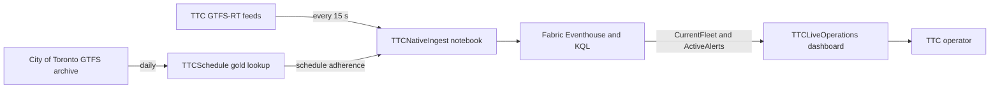

## Purpose

> [!TIP]
> For the shortest path from a clone to a running workload, read the
> [deployment quickstart](DEPLOYMENT-QUICKSTART.md) first. This guide is the
> reference for detail, failure modes, and recovery.

This guide deploys the TTC Digital Twin from a fresh clone and operates it as a
mostly Fabric-contained workload. It covers:

* Microsoft Fabric Real-Time Intelligence items
* The Eventhouse KQL functions that serve the application
* The Rayfin Fabric App, Fabric SSO, and managed SQL data
* The TTC GTFS-realtime publisher and snapshot API
* Validation, monitoring, rollback, and disaster recovery
* Additional data that would improve TTC operator decisions

The repository is the source of truth for all Fabric definitions, KQL schema,
Rayfin schema, application code, and publisher code.

## Platform Boundary

Fabric contains the entire data plane. Nothing outside Fabric is required to
ingest, store, or serve this workload.

* `TTCNativeIngest` polls the TTC feeds, decodes protobuf, and enriches rows.
* Eventhouse is the single serving store for vehicle, trip, and alert history.
* KQL functions answer every operational question the dashboard asks.
* `TTCLiveOperations` serves operators directly from Eventhouse.

The container publisher is retained for the optional Eventstream ingestion
path only. It ships scaled to zero with ingress disabled and is not in the
serving path.

> [!IMPORTANT]
> Because polling, storage, and serving all sit on Fabric capacity, pausing
> the capacity takes all three down together. The Kusto endpoint stops
> resolving, ingestion stops, and the dashboard goes blank. This regression
> was accepted deliberately; see
> [Fabric-Native Publisher Alternative](FABRIC-NATIVE-ALTERNATIVE.md).

Telemetry storage is deliberately single-tier.

> [!NOTE]
> There is one telemetry store. Every TTC event lands in `TTCOperations`, and
> the dashboard reads it through KQL. Eventhouse retention therefore bounds
> history at 30 days for movement data and 90 days for alerts. Add a Lakehouse
> destination only when you need history beyond those windows.

## Runtime Architecture



## Fabric Items

The deployment script creates or reuses the following names.

| Fabric item | Repository definition |
| --- | --- |
| `TTCEventhouse` | `scripts/deployFabric.ts` |
| `TTCOperations` | `fabric/eventhouse/` |
| `TTCTelemetry` | `fabric/eventstream/` |
| `TTCSchedule` | `scripts/deployFabric.ts` |
| `TTCScheduleBronze` | `fabric/notebook-bronze/` |
| `TTCScheduleSilver` | `fabric/notebook-silver/` |
| `TTCScheduleGold` | `fabric/notebook-gold/` |
| `TTCNativeIngest` | `fabric/notebook-ingest/` |
| `TTCLiveOperations` | `fabric/dashboard/` |
| `TTCFeedDecoder` | `fabric/notebook/` |
| Rayfin AppBackend | `rayfin/rayfin.yml` |
| Rayfin managed SQL | `rayfin/data/` |

The deployment is idempotent by item name. Existing Eventstream definitions
are compared before update. The KQL schema uses create-or-merge and
create-or-alter operations. Notebook parameter defaults are templated with the
resolved Lakehouse and Eventhouse identifiers at deploy time, so scheduled runs
need no arguments.

## Static Reference Data

Schedule adherence needs the published timetable, which the realtime feed does
not carry. The `TTCSchedule` Lakehouse holds it in medallion layers:

| Table | Layer | Contents |
| --- | --- | --- |
| `bronze_stop_times` | Bronze | `stop_times.txt` as published |
| `bronze_trips` | Bronze | `trips.txt` as published, plus provenance |
| `silver_stop_times` | Silver | Typed rows with clock times parsed to seconds |
| `gold_schedule_lookup` | Gold | One row per trip and stop sequence |

`TTCScheduleBronze` downloads the City of Toronto GTFS archive and chains silver
and gold, so one daily schedule refreshes the whole chain. A daily 03:00 Eastern
schedule is registered against the bronze notebook.

GTFS allows clock times beyond `24:00:00` for trips crossing midnight, so the
silver layer parses the components rather than casting to a timestamp.

> [!NOTE]
> Static reference data lives in the Lakehouse because it changes daily and
> benefits from layered refinement. Live telemetry lives in Eventhouse because
> it changes every few seconds and is queried with KQL. Do not merge the two.

## Ingestion Paths

Three paths can populate `TTCOperations`. The native path is the default.

| Path | Component | Enabled by |
| --- | --- | --- |
| Native | `TTCNativeIngest` notebook | Default, Cron every 30 min |
| Decoded publisher | Container App and Eventstream | Optional |
| Raw forward | Container and decoder notebook | `PUBLISHER_RAW_FEED_MODE` |

The native path fetches and decodes inside Fabric, so no component outside
Fabric participates. The decoded path normalizes events in the container and
lets the Eventstream SQL operator route them. The raw path forwards undecoded
protobuf, gzip and base64 encoded, and decodes it in a Spark notebook.

All three write the same Eventhouse tables. Running more than one at a time
duplicates rows; `CurrentFleet()` collapses them with `arg_max` per vehicle,
so results stay correct while storage grows.

The native path runs on a schedule rather than continuously. Each session
polls for twenty eight minutes and a new session starts every thirty, which
leaves a short gap between sessions. `CurrentFleet()` looks back thirty five
minutes so the dashboard stays populated across it.

## Data Contracts and Retention

### Eventstream

`TTCTelemetry` has one Custom Endpoint named `TTCPublisher`. Its SQL operator
routes three normalized event types, all into `TTCOperations`:

* `VehiclePosition` goes to the `VehiclePositions` table.
* `TripUpdate` goes to the `TripUpdates` table.
* `ServiceAlert` goes to the `ServiceAlerts` table.

Eventstream uses medium throughput and one-day stream retention. Low throughput
cannot keep pace with the trip-update volume; observation lag grows until
`CurrentFleet()` returns nothing.

### Eventhouse ingestion

`TTCOperations` contains these tables and policies:

| Table | Retention | Hot cache |
| --- | --- | --- |
| `VehiclePositions` | 30 days | 7 days |
| `TripUpdates` | 30 days | 7 days |
| `ServiceAlerts` | 90 days | 30 days |

Reusable functions are defined in `DatabaseSchema.kql`:

* `CurrentFleet()` returns the newest observation per active vehicle.
* `RoutePerformance()` summarizes schedule adherence by route and mode.
* `ActiveAlerts()` returns alerts whose active window has not ended.

### Serving path

`TTCLiveOperations` reads Eventhouse directly through the KQL functions above.
It refreshes every minute and is governed by Fabric identity, so there is no
separate sign-in and no publicly reachable endpoint.

| Tile group | Query |
| --- | --- |
| Fleet, on-time, delayed, feed age | `CurrentFleet` |
| Live fleet map and mode split | `CurrentFleet` |
| Route and deviation breakdowns | `CurrentFleet` |
| Active service alerts | `ActiveAlerts` |

The dashboard definition lives in `fabric/dashboard/` and is provisioned by
`scripts/deployFabric.ts`, so portal edits are overwritten on the next deploy.
Change the definition in the repository, not in the portal.

#### Optional container query path

The container publisher also exposes read-only endpoints. They are not used by
the default deployment and the container ships scaled to zero with ingress
disabled.

| Endpoint | Query | Purpose |
| --- | --- | --- |
| `/api/live` | `CurrentFleet` and `ActiveAlerts` | Live map and alerts |
| `/api/route-performance` | `RoutePerformance` | Route adherence summaries |
| `/api/snapshot` | None | Fall back to in-memory poller state |

The `lookback` parameter is restricted to an allow list, so caller input never
reaches the KQL text. Queries authenticate with the container managed
identity. Grant that identity viewer access on `TTCOperations` before enabling
`/api/live`.

### Rayfin

Rayfin provides Fabric SSO, static hosting, and a managed MSSQL database. The
`OperatorNote` entity is filtered by the signed-in user's subject claim. The
publishable browser key is not a service credential.

## Reference Environment

These names describe the shape of a deployment, not a public endpoint. Use
parameters for new environments rather than copying identifiers, and read your
own values from the gitignored `.fabric/deployment.local.json`.

| Resource | Reference value |
| --- | --- |
| Fabric workspace | One workspace on supported capacity |
| Fabric capacity | `F64` used for this build |
| Azure region | `eastus2` |
| Resource group | `rg-fabric-rayfin` |
| Publisher app | `ca-ttc-digital-twin-publisher` |
| Publisher image | `ttc-digital-twin-publisher:<tag>` |
| Publisher size | 0.5 CPU and 1 GiB |
| Publisher scale | One minimum and one maximum replica |
| Rayfin app | Reached through the Fabric portal |
| Publisher health | `<publisher-ingress>/api/health` |

The publisher uses a system-assigned managed identity and pulls its image from
Azure Container Registry. HTTPS ingress is enabled on port 7071. Insecure HTTP
is disabled.

> [!WARNING]
> The currently deployed `20260814.2` publisher predates `/api/ready` and
> `lastPublishSucceededAt`. Before applying the readiness probe or rotating
> Eventstream credentials in this environment, deploy the current publisher
> source under a new immutable tag and require `/api/ready` to return 200. Do
> not use `20260814.2` as a rollback target after readiness probes are enabled.

## Prerequisites

### Local tools

Install the following tools before deployment:

* Node.js 22 or later
* npm
* Azure CLI with the Container Apps extension
* PowerShell 7 for the commands in this guide
* Git

Docker is optional because Azure Container Registry can build the publisher
image remotely.

### Fabric access

The deployment identity needs:

* Contributor or higher access to the target Fabric workspace
* Access to a capacity that supports Fabric Apps
* Permission to create Eventhouse, KQL database, and Eventstream items
* Permission to grant the publisher identity viewer access on `TTCOperations`
* Fabric Apps enabled by the tenant administrator

### Azure access

The deployment identity needs permission to:

* Create or update a resource group, registry, and Container Apps environment
* Create or update a Container App
* Assign the `AcrPull` role to a managed identity
* Build images in Azure Container Registry

Use a service principal or workload identity in CI. Use interactive Azure CLI
authentication only for an operator-driven deployment.

## Files That Stay Local

The following generated files are intentionally ignored by Git:

* `.fabric/deployment.local.json` contains non-secret Fabric item IDs.
* `rayfin/.deployments.json` contains the active Rayfin deployment record.
* `rayfin/.env*` may contain generated environment values.
* `data/gtfs-static/` contains the downloaded static GTFS source and index.
* `dist/` contains the production application bundle.

Never commit Eventstream connection strings, Azure access tokens, Rayfin
runtime secrets, or Container Apps secret values.

## Fresh Deployment

### 1. Bootstrap the repository

Run these commands from the repository root:

```powershell
az extension add --name containerapp --upgrade
npm ci
npm run gtfs:sync
npm run fabric:plan
npm test
npm run lint
npm run typecheck:tools
npm run build
```

`npm run gtfs:sync` is required before building the publisher image. The
Dockerfile copies `stop_times.txt` and `schedule-offsets.json` into the image.

`npm run fabric:plan` is a local rendering check. It resolves template values,
parses the generated JSON, and counts definition parts. It does not contact
Fabric, compute a remote diff, validate KQL semantics, or detect a destructive
schema change.

### 2. Define deployment variables

Use environment-specific values. Azure Container Registry names must be
globally unique and contain only alphanumeric characters.

```powershell
$TenantId = '<tenant-id>'
$SubscriptionId = '<subscription-id>'
$WorkspaceName = '<fabric-workspace-name>'
$ResourceGroup = '<azure-resource-group>'
$Location = 'eastus2'
$AcrName = '<globally-unique-acr-name>'
$ContainerEnvironment = '<container-apps-environment>'
$PublisherName = 'ca-ttc-digital-twin-publisher'
$ImageTag = Get-Date -Format 'yyyyMMdd.HHmm'
$Image = "$AcrName.azurecr.io/ttc-digital-twin-publisher:$ImageTag"
```

### 3. Isolate and assert Azure context

The Fabric deployment script refuses to run without `AZURE_CONFIG_DIR`. This
prevents a terminal signed into another tenant from changing the wrong
workspace.

```powershell
$env:AZURE_CONFIG_DIR = "$env:USERPROFILE\.azure-tenants\<alias>"
az login --tenant $TenantId
az account set --subscription $SubscriptionId

$Account = az account show --output json | ConvertFrom-Json
if ($Account.tenantId -ne $TenantId) {
  throw "Wrong tenant: $($Account.tenantId)"
}
if ($Account.id -ne $SubscriptionId) {
  throw "Wrong subscription: $($Account.id)"
}

az provider register `
  --namespace Microsoft.App `
  --subscription $SubscriptionId `
  --wait
az provider register `
  --namespace Microsoft.ContainerRegistry `
  --subscription $SubscriptionId `
  --wait
```

Provider registration is subscription-scoped and therefore runs only after the
tenant and subscription assertions pass.

### 4. Prepare the Fabric workspace

Create the workspace in the Fabric portal and assign it to a supported
capacity. The repository deployment script creates workload items inside an
existing workspace; it does not create the workspace or assign capacity.

Use the workspace ID when names are duplicated across the tenant.

### 5. Deploy Fabric Real-Time Intelligence

Deploy by workspace name:

```powershell
npm run fabric:deploy -- `
  --tenant-id $TenantId `
  --subscription $SubscriptionId `
  --workspace-name $WorkspaceName
```

Alternatively, replace `--workspace-name` with `--workspace-id`.

The command writes non-secret IDs to `.fabric/deployment.local.json`. Confirm
that all six Fabric items appear in the workspace before proceeding.

### 6. Resolve the Eventstream connection in memory

The local `npm run fabric:publisher` command performs this lookup itself and
never writes the connection string. The hosted publisher needs the same values
stored in Container Apps.

The following PowerShell obtains them without printing the password:

```powershell
$Deployment = Get-Content .fabric/deployment.local.json | ConvertFrom-Json
$FabricToken = az account get-access-token `
  --resource https://api.fabric.microsoft.com `
  --query accessToken `
  --output tsv
$Headers = @{ Authorization = "Bearer $FabricToken" }
$EventstreamBase = "https://api.fabric.microsoft.com/v1/workspaces/" +
  "$($Deployment.workspaceId)/eventstreams/$($Deployment.eventstreamId)"

$Topology = Invoke-RestMethod `
  -Headers $Headers `
  -Uri "$EventstreamBase/topology"
$Sources = if ($Topology.sources) {
  $Topology.sources
} else {
  $Topology.topology.sources
}
$Source = @($Sources) |
  Where-Object name -eq $Deployment.eventstreamSourceName |
  Select-Object -First 1
if (-not $Source) {
  throw "Eventstream source was not found."
}

$Connection = Invoke-RestMethod `
  -Headers $Headers `
  -Uri "$EventstreamBase/sources/$($Source.id)/connection"
$EventstreamBrokers = "$($Connection.fullyQualifiedNamespace):9093"
$EventstreamTopic = $Connection.eventHubName
$EventstreamUsername = '$ConnectionString'
$EventstreamPassword = $Connection.accessKeys.primaryConnectionString
```

Treat `$EventstreamPassword` and `$Connection` as secrets. Do not echo them or
persist them to a file. Run this procedure in a dedicated deployment shell and
close that shell after deployment.

### 7. Create the publisher infrastructure

Create the shared Azure resources once:

```powershell
az group create `
  --name $ResourceGroup `
  --location $Location

az acr create `
  --resource-group $ResourceGroup `
  --name $AcrName `
  --sku Basic

az containerapp env create `
  --resource-group $ResourceGroup `
  --name $ContainerEnvironment `
  --location $Location
```

If the registry or Container Apps environment already exists, reuse it rather
than running its create command again.

Build an immutable image from the repository root:

```powershell
az acr build `
  --registry $AcrName `
  --image "ttc-digital-twin-publisher:$ImageTag" `
  --file Dockerfile.publisher `
  .
```

Create the Container App with a public placeholder image. This establishes its
system identity before private-registry access is configured.

```powershell
az containerapp create `
  --resource-group $ResourceGroup `
  --name $PublisherName `
  --environment $ContainerEnvironment `
  --image mcr.microsoft.com/k8se/quickstart:latest `
  --system-assigned `
  --cpu 0.5 `
  --memory 1Gi `
  --min-replicas 1 `
  --max-replicas 1
```

Grant the app identity pull access and configure identity-based registry
authentication:

```powershell
$PublisherPrincipalId = az containerapp show `
  --resource-group $ResourceGroup `
  --name $PublisherName `
  --query identity.principalId `
  --output tsv
$AcrId = az acr show `
  --resource-group $ResourceGroup `
  --name $AcrName `
  --query id `
  --output tsv

az role assignment create `
  --assignee-object-id $PublisherPrincipalId `
  --assignee-principal-type ServicePrincipal `
  --role AcrPull `
  --scope $AcrId

az containerapp registry set `
  --resource-group $ResourceGroup `
  --name $PublisherName `
  --server "$AcrName.azurecr.io" `
  --identity system
```

Store the Eventstream password and configure the publisher. The placeholder
origin keeps browser access closed until Rayfin returns its hosting URL.

```powershell
az containerapp secret set `
  --resource-group $ResourceGroup `
  --name $PublisherName `
  --secrets "eventstream-password=$EventstreamPassword"

az containerapp update `
  --resource-group $ResourceGroup `
  --name $PublisherName `
  --image $Image `
  --set-env-vars `
    "PORT=7071" `
    "PUBLISHER_ALLOWED_ORIGIN=https://deployment-pending.invalid" `
    "FABRIC_EVENTSTREAM_BROKERS=$EventstreamBrokers" `
    "FABRIC_EVENTSTREAM_TOPIC=$EventstreamTopic" `
    "FABRIC_EVENTSTREAM_USERNAME=$EventstreamUsername" `
    "FABRIC_EVENTSTREAM_PASSWORD=secretref:eventstream-password" `
    "KAFKAJS_NO_PARTITIONER_WARNING=1"

az containerapp ingress enable `
  --resource-group $ResourceGroup `
  --name $PublisherName `
  --type external `
  --target-port 7071 `
  --transport auto `
  --allow-insecure false
```

Container Apps supplies TCP probes when ingress is enabled and custom probes
are absent. TCP readiness proves only that port 7071 is open. Apply a custom
HTTP readiness probe so single-revision traffic moves only after the publisher
has collected a real TTC snapshot. Keep liveness as TCP so a temporary TTC or
Eventstream failure does not cause a restart loop.

```powershell
$ContainerApp = az containerapp show `
  --resource-group $ResourceGroup `
  --name $PublisherName `
  --subscription $SubscriptionId `
  --output json | ConvertFrom-Json
$Container = $ContainerApp.properties.template.containers[0]
$Probes = @(
  @{
    type = 'Startup'
    tcpSocket = @{ port = 7071 }
    initialDelaySeconds = 1
    periodSeconds = 10
    timeoutSeconds = 3
    failureThreshold = 10
    successThreshold = 1
  },
  @{
    type = 'Liveness'
    tcpSocket = @{ port = 7071 }
    initialDelaySeconds = 30
    periodSeconds = 10
    timeoutSeconds = 3
    failureThreshold = 3
    successThreshold = 1
  },
  @{
    type = 'Readiness'
    httpGet = @{
      path = '/api/ready'
      port = 7071
      scheme = 'HTTP'
    }
    initialDelaySeconds = 5
    periodSeconds = 10
    timeoutSeconds = 3
    failureThreshold = 6
    successThreshold = 1
  }
)
$Container | Add-Member `
  -MemberType NoteProperty `
  -Name probes `
  -Value $Probes `
  -Force
$ProbePatch = @{
  location = $ContainerApp.location
  properties = @{
    template = $ContainerApp.properties.template
  }
} | ConvertTo-Json -Depth 100
$ProbePatchPath = Join-Path $env:TEMP 'ttc-publisher-probes.json'
[IO.File]::WriteAllText(
  $ProbePatchPath,
  $ProbePatch,
  [Text.UTF8Encoding]::new($false)
)
$ContainerAppId = $ContainerApp.id
az rest `
  --method patch `
  --url "${ContainerAppId}?api-version=2025-07-01" `
  --body "@$ProbePatchPath" `
  --only-show-errors `
  --output none
Remove-Item $ProbePatchPath
```

The probe uses HTTP inside the Container Apps environment because TLS
terminates at ingress. `/api/ready` returns 503 until Eventstream is configured
and TTC polling and Fabric publishing have both succeeded. Local publisher mode
without Eventstream uses `/api/health`, not `/api/ready`. `/api/health` remains
the dependency-health signal for monitoring.

Clear secret-bearing local variables after the update:

```powershell
Remove-Variable EventstreamPassword, Connection, FabricToken, Headers,
  Topology, Sources, Source -ErrorAction SilentlyContinue
```

### 8. Deploy the Rayfin Fabric App

Get the publisher hostname and pass it into the Vite production build:

```powershell
$PublisherFqdn = az containerapp show `
  --resource-group $ResourceGroup `
  --name $PublisherName `
  --query properties.configuration.ingress.fqdn `
  --output tsv
$env:VITE_TELEMETRY_API_URL = "https://$PublisherFqdn"

npx rayfin login --tenant $TenantId
npx rayfin login status
npx rayfin up `
  --tenant $TenantId `
  --workspace-id $Deployment.workspaceId
npx rayfin up status --json
```

`rayfin up` is the canonical deployment command. It applies the managed SQL
schema, builds the app, deploys static assets, and updates the Fabric app.
`VITE_TELEMETRY_API_URL` is a build-time value. Set it for every application
deployment and rollback. Do not rely on the repository's current
`.env.production` value when targeting another environment.

Read the generated hosting URL and restrict publisher CORS to that one origin:

```powershell
$RayfinRegistry = Get-Content rayfin/.deployments.json | ConvertFrom-Json
$ActiveDeployment = $RayfinRegistry.active
$RayfinUrl = $RayfinRegistry.deployments.$ActiveDeployment.hostingUrl

az containerapp update `
  --resource-group $ResourceGroup `
  --name $PublisherName `
  --set-env-vars "PUBLISHER_ALLOWED_ORIGIN=$RayfinUrl"
```

Do not use `*` for production CORS.

### 9. Connect the publisher to Eventhouse queries

The `/api/live` endpoint reads `TTCOperations` with the publisher's
system-assigned managed identity. Grant that identity viewer access, then point
the app at the query endpoint.

Resolve the identity's application ID:

```powershell
$PrincipalId = az containerapp identity show `
  --resource-group $ResourceGroup `
  --name $PublisherName `
  --query principalId `
  --output tsv

$AppId = az ad sp show --id $PrincipalId --query appId --output tsv
$TenantId = az account show --query tenantId --output tsv
Write-Output "aadapp=$AppId;$TenantId"
```

In the Fabric portal, open `TTCOperations`, choose **Manage permissions**, and
add that principal as a viewer. The equivalent KQL management command is:

```kusto
.add database TTCOperations viewers ('aadapp=<appId>;<tenantId>')
```

Then publish the query endpoint to the app:

```powershell
$Deployment = Get-Content .fabric/deployment.local.json | ConvertFrom-Json

az containerapp update `
  --resource-group $ResourceGroup `
  --name $PublisherName `
  --set-env-vars `
    "FABRIC_KQL_QUERY_URI=$($Deployment.queryServiceUri)" `
    "FABRIC_KQL_DATABASE=$($Deployment.kqlDatabaseName)"
```

Confirm the endpoint returns fleet rows from Eventhouse rather than the
in-memory fallback:

```powershell
$Live = Invoke-RestMethod "$PublisherUrl/api/live"
"$($Live.vehicles.Count) vehicles, $($Live.alerts.Count) alerts at $($Live.observedAt)"
```

Until this step completes, `/api/live` returns HTTP 503 and the browser falls
back to `/api/snapshot`. The map still works; it is served from poller memory
rather than from Eventhouse.

## Post-Deployment Validation

### Publisher health

```powershell
$Health = Invoke-RestMethod "https://$PublisherFqdn/api/health"
$Health | Select-Object status, lastPollSucceededAt, lastError,
  lastPublishSucceededAt, eventstreamEnabled, snapshot
```

Expected results:

* `status` is `ready`.
* `lastError` is empty.
* `eventstreamEnabled` is `true`.
* `lastPollSucceededAt` is recent.
* `lastPublishSucceededAt` is recent.
* Snapshot vehicle count is greater than zero during service hours.

Confirm rollout readiness independently:

```powershell
$Ready = Invoke-RestMethod "https://$PublisherFqdn/api/ready"
if ($Ready.status -ne 'ready') {
  throw 'Publisher has not completed TTC polling and Fabric publishing.'
}
```

Check the snapshot contract:

```powershell
$Snapshot = Invoke-RestMethod "https://$PublisherFqdn/api/snapshot"
$Snapshot.source
$Snapshot.observedAt
$Snapshot.vehicles.Count
$Snapshot.alerts.Count
```

### Eventhouse

Run these queries in the `TTCOperations` KQL query editor:

```kusto
CurrentFleet()
| count

VehiclePositions
| summarize LastVehicleEvent=max(ObservedAt), Rows=count()

TripUpdates
| summarize LastTripEvent=max(ObservedAt), Rows=count()

ServiceAlerts
| summarize LastAlertEvent=max(ObservedAt), Rows=count()

RoutePerformance(30m)
| take 20
```

The latest event timestamps should remain within the poll and ingestion delay.

### Eventstream topology

Open `TTCTelemetry` in Fabric and verify each node independently:

* `TTCPublisher` receives increasing event counts.
* `RouteTransitEvents` is running without SQL errors.
* `VehicleEventhouse` is running and writing `VehiclePositions`.
* `TripEventhouse` is running and writing `TripUpdates`.
* `AlertEventhouse` is running and writing `ServiceAlerts`.

Do not infer destination health only from source input counts.

### Application query path checks

Confirm that:

* `/api/health` reports `kqlConfigured` as `true`.
* `/api/live` returns HTTP 200 with a non-empty `vehicles` array.
* `/api/route-performance?lookback=30m` returns route rows.
* `/api/route-performance?lookback=90m` returns HTTP 400.

The last check verifies that the lookback allow list is enforced.

### Fabric-hosted Rayfin application

Open the application from the Fabric portal so embedded Fabric SSO can
complete. Confirm that:

* The source status reads `GTFS-RT live`.
* The map shows current surface vehicles and service alerts.
* Selecting a vehicle opens the line and vehicle story.
* Selecting empty map space clears the selection.
* Both 2D and 3D map modes render.
* Operator notes can be created and are isolated by signed-in user.

Direct navigation to the static URL may remain on the authentication page.
Fabric SSO is expected to complete in the Fabric portal host.

### Automated validation

Run repository checks before every deployment:

```powershell
npm test
npm run lint
npm run typecheck:tools
npm run build
npx --yes markdownlint-cli2 README.md DEPLOYMENT.md
```

Use `npm run validate:ui` against the local demo or an optimized demo build.
The script checks desktop and mobile layout, selection, deselection, 2D and 3D
rendering, vector-tile responses, and canvas pixels.

## Incremental Deployment

### Application-only change

Repeat the tenant and subscription assertions from the fresh deployment before
resolving the publisher. Pass the subscription explicitly to every Azure CLI
read used to construct a build-time value.

```powershell
npm test
npm run lint
$PublisherFqdn = az containerapp show `
  --resource-group '<resource-group>' `
  --name ca-ttc-digital-twin-publisher `
  --subscription '<subscription-id>' `
  --query properties.configuration.ingress.fqdn `
  --output tsv
$env:VITE_TELEMETRY_API_URL = "https://$PublisherFqdn"
npx rayfin up `
  --tenant '<tenant-id>' `
  --workspace-id '<workspace-id>'
npx rayfin up status --json
```

If the telemetry value is omitted, the compiled app can fall back to simulated
data or point to another environment.

### Fabric definition change

```powershell
npm run fabric:plan
npm run fabric:deploy -- `
  --tenant-id '<tenant-id>' `
  --subscription '<subscription-id>' `
  --workspace-id '<workspace-id>'
```

### Publisher code or GTFS change

Refresh GTFS first when schedules or route geometry changed:

Repeat the tenant and subscription assertions from the fresh deployment before
running these commands. Every Azure operation below pins the asserted
subscription.

```powershell
npm run gtfs:sync
$ImageTag = Get-Date -Format 'yyyyMMdd.HHmm'
$Image = "$AcrName.azurecr.io/ttc-digital-twin-publisher:$ImageTag"

az acr build `
  --registry $AcrName `
  --subscription $SubscriptionId `
  --image "ttc-digital-twin-publisher:$ImageTag" `
  --file Dockerfile.publisher `
  .

az containerapp update `
  --resource-group $ResourceGroup `
  --name $PublisherName `
  --subscription $SubscriptionId `
  --image $Image
```

Use immutable image tags. Do not deploy `latest`. After updating an environment
that predates the readiness contract, require `/api/ready` to return 200 before
applying custom readiness probes.

## Operations

### Normal cadence

* Poll GTFS-realtime every 15 seconds.
* Check `/api/health` at least every minute.
* Alert when the last successful poll is older than one minute.
* Alert on a non-empty `lastError` or `eventstreamEnabled=false`.
* Review Eventstream source and destination health after capacity changes.
* Refresh static GTFS when the City publishes a new archive.
* Alert when `/api/live` returns HTTP 503 for more than five minutes.
* Review KQL retention and cache policy before increasing Eventstream volume.

### Recommended monitoring

Add Azure Monitor and Application Insights for the external publisher. Capture:

* HTTP health status and latency
* TTC poll duration and failure count
* Feed age and vehicle count
* Events produced per type
* Kafka publish latency, retry count, and failed batches
* Container restart count, CPU, memory, and replica state

Add Fabric monitoring for:

* Eventstream input and destination errors
* Eventhouse ingestion latency and row counts
* KQL query duration and failure rate for `CurrentFleet` and `ActiveAlerts`
* Fabric capacity throttling

### Secret rotation

Rotate the Eventstream Custom Endpoint credentials in Fabric, then repeat the
connection lookup. Refresh brokers, topic, username, and password together
because recreating a source can change more than its password.

Use a versioned secret name and a new revision. In single-revision mode, the
existing revision continues serving until the new revision passes
`/api/ready`.

Repeat the tenant and subscription assertions before rotation. Enforce
single-revision mode so a drifted multiple-mode app cannot leave an old
revision serving with the prior credential.

```powershell
$RotationTag = Get-Date -Format 'yyyyMMddHHmmss'
$SecretName = "es-$RotationTag"
az containerapp revision set-mode `
  --resource-group $ResourceGroup `
  --name $PublisherName `
  --subscription $SubscriptionId `
  --mode single `
  --only-show-errors `
  --output none

az containerapp secret set `
  --resource-group $ResourceGroup `
  --name $PublisherName `
  --subscription $SubscriptionId `
  --secrets "$SecretName=$EventstreamPassword" `
  --only-show-errors `
  --output none

az containerapp update `
  --resource-group $ResourceGroup `
  --name $PublisherName `
  --subscription $SubscriptionId `
  --revision-suffix "eventstream-$RotationTag" `
  --set-env-vars `
    "FABRIC_EVENTSTREAM_BROKERS=$EventstreamBrokers" `
    "FABRIC_EVENTSTREAM_TOPIC=$EventstreamTopic" `
    "FABRIC_EVENTSTREAM_USERNAME=$EventstreamUsername" `
    "FABRIC_EVENTSTREAM_PASSWORD=secretref:$SecretName" `
  --only-show-errors `
  --output none

$Deadline = (Get-Date).AddMinutes(5)
do {
  $TargetRevision = az containerapp show `
    --resource-group $ResourceGroup `
    --name $PublisherName `
    --subscription $SubscriptionId `
    --query properties.latestRevisionName `
    --output tsv
  $ReadyRevision = az containerapp show `
    --resource-group $ResourceGroup `
    --name $PublisherName `
    --subscription $SubscriptionId `
    --query properties.latestReadyRevisionName `
    --output tsv
  if ($TargetRevision -eq $ReadyRevision) {
    break
  }
  if ((Get-Date) -ge $Deadline) {
    throw "New revision did not become ready: $TargetRevision"
  }
  Start-Sleep -Seconds 5
} while ($true)
```

Confirm `/api/ready`, `/api/health`, Eventstream input, and Eventhouse
timestamps before revoking the prior credential. Deactivate revisions that
reference the old secret before removing it. A Key Vault reference is the
preferred production hardening path when the secret lifecycle is managed
centrally.

## Rollback and Recovery

### Roll back Rayfin

Check out the previous known-good commit and run `rayfin up` again. Rayfin
creates a new static deployment from that commit. Do not use destructive schema
flags unless the generated migration has been reviewed.

Repeat the tenant and subscription assertions first. Resolve the publisher from
the asserted subscription rather than ambient CLI context.

```powershell
$PublisherFqdn = az containerapp show `
  --resource-group '<resource-group>' `
  --name ca-ttc-digital-twin-publisher `
  --subscription '<subscription-id>' `
  --query properties.configuration.ingress.fqdn `
  --output tsv
$env:VITE_TELEMETRY_API_URL = "https://$PublisherFqdn"
npx rayfin up `
  --tenant '<tenant-id>' `
  --workspace-id '<workspace-id>'
npx rayfin up status --json
```

### Publisher

List prior immutable image tags and update the app to the last known-good tag:

Repeat the tenant and subscription assertions first. A rollback image is
eligible only if it was tested with the current `/api/ready` contract. Exclude
`20260814.2` and any other image that returns 404 for `/api/ready`.

```powershell
az acr repository show-tags `
  --name $AcrName `
  --subscription $SubscriptionId `
  --repository ttc-digital-twin-publisher `
  --orderby time_desc `
  --output table

az containerapp update `
  --resource-group $ResourceGroup `
  --name $PublisherName `
  --subscription $SubscriptionId `
  --image "$AcrName.azurecr.io/ttc-digital-twin-publisher:<tag>"
```

After the rollback revision becomes ready, confirm `/api/ready`,
`/api/health`, Eventstream input, and Eventhouse timestamps.

### Fabric definitions

Revert the definition change in Git, run `npm run fabric:plan`, then rerun the
Fabric deployment. The current KQL script is non-destructive. Review any future
drop, rename, or type-change operation before deployment.

### Rebuild the environment

A new Fabric workspace can be rebuilt from the repository:

1. Assign the new workspace to supported capacity.
2. Run the Fabric deployment against the new workspace.
3. Rebuild and deploy the publisher with new Eventstream credentials.
4. Set the new publisher URL and run tenant-aware `rayfin up` against the new
  workspace.
5. Grant the new publisher identity viewer access on `TTCOperations` and set
  `FABRIC_KQL_QUERY_URI`.

This process rebuilds infrastructure and resumes ingestion. It does not restore
historical state by itself.

### Recover state

The repository currently has no automated backup or cross-region recovery
workflow. Treat the following as production-readiness requirements, not current
capabilities.

| State | Current protection | Recovery requirement |
| --- | --- | --- |
| Configuration | Git | Rebuild from a known-good commit |
| Snapshot | TTC feed | Resume; missed snapshots are not replayed |
| Eventhouse | 30/90 days | Test recovery; export history to OneLake |
| Notes | Rayfin SQL | Test point-in-time restore or export |
| Stream secret | Fabric | Resolve and update the credential |

Before production use, define approved recovery point and recovery time
objectives for each row. Run a recovery exercise into a separate workspace. Do
not describe an environment rebuild as historical data recovery until
Eventhouse and operator-note restore tests have passed.

> [!IMPORTANT]
> Eventhouse is the only telemetry store, so its retention window is the
> retention window for the whole workload. Anything older than 30 days for
> movement data or 90 days for alerts is gone unless you export it. Add a
> Lakehouse destination to `TTCTelemetry` before you need multi-year history.

### Production acceptance gates

The current repository is deployment-ready for a pilot or test environment.
Before classifying an environment as production, require evidence that:

* Eventhouse history has an approved export and restore procedure.
* Retention beyond the Eventhouse window has an owner and a destination.
* Rayfin managed SQL notes have a tested point-in-time restore or export path.
* Recovery owners, recovery point objectives, and recovery time objectives are
  recorded.
* A restore drill into a separate Fabric workspace has passed.
* The public snapshot and health endpoints have approved authentication,
  redaction, throttling, and monitoring controls.

## Troubleshooting

### Tenant or subscription assertion fails

Use a unique `AZURE_CONFIG_DIR` for the tenant, sign in again, and verify
`az account show`. Do not remove the assertion from the deployment script.

### Workspace name is ambiguous

Pass `--workspace-id` instead of `--workspace-name`.

### Publisher starts without Eventstream

All four Eventstream variables must be set together. Confirm brokers, topic,
username, and the secret reference. `/api/health` must report
`eventstreamEnabled=true`.

### Publisher reports no schedule adherence

Run `npm run gtfs:sync` before building the image. Confirm that both
`stop_times.txt` and `schedule-offsets.json` are present in the container.

### Eventstream rejects a publish request

The publisher intentionally batches below 800 KB. Do not increase the target
above the Event Hubs request limit. Check for a single unexpectedly large
service-alert payload.

### Eventhouse has no rows

Confirm that Eventstream is running, the Custom Endpoint source is connected,
and processed ingestion destinations point to `TTCOperations`. Compare the
publisher health timestamp with Eventstream input metrics.

### `/api/live` returns HTTP 503

The response `detail` field carries the underlying reason. Check, in order:

* `FABRIC_KQL_QUERY_URI` is set on the Container App.
* The publisher managed identity is a viewer on `TTCOperations`.
* `TTCOperations` contains rows for the requested window.

Until this endpoint recovers, the browser serves the map from `/api/snapshot`,
so a query failure degrades freshness rather than removing the map.

### Browser cannot call the snapshot API

The publisher CORS origin must exactly equal the Rayfin hosting origin. Include
the scheme and omit a trailing slash.

CORS restricts browser origins; it does not authenticate the endpoint. The
current public snapshot contains public TTC data. Add Entra authentication or a
governed API gateway before exposing internal TTC, employee, incident, or
passenger data through this API.

`/api/health` currently includes `lastError`. Redact dependency details or put
the detailed endpoint behind authentication before production use. Apply rate
limits at the gateway or ingress boundary.

### Fabric SSO remains on the sign-in page

Open the app from the Fabric portal. Fabric SSO is embedded-host dependent and
is not expected to complete from every direct browser context.

### 3D map fails while 2D works

Confirm WebGL 2 support and verify that the Vite build emitted a self-contained
`maplibre-gl-worker-*.js` asset. The source import must retain `?worker&url`.
The application automatically returns unsupported browsers to Leaflet 2D.

## Operator Information Roadmap

The current application already provides:

* Live bus and streetcar locations
* Route, trip, speed, bearing, and vehicle identity
* Estimated schedule deviation and state
* Occupancy when TTC supplies it
* Service-alert severity, title, description, routes, and update time in the UI
* Service-alert cause, effect, and first active window in Eventhouse
* Static route geometry, stops, parent stations, and wheelchair flags
* Historical vehicle, trip, and alert records in Eventhouse
* User-scoped operator notes

The following sources would make the workspace more informative for TTC
operators.

### Data-source intake matrix

The values below are starting targets. Confirm retention and ownership with TTC
privacy, records, security, and operational owners before implementation.

| Source | Freshness | Owner |
| --- | --- | --- |
| TTC GTFS-RT | 15-second poll | TTC |
| Static GTFS | Quarterly | TTC and Toronto Open Data |
| Road Restrictions | Real-time | Transportation Services |
| Festivals and Events | Temporary real-time feed | City of Toronto |
| Weather | Real-time and alerts | Environment Canada |
| TTC delay records | Monthly | TTC |
| TTC ridership | Annual or as available | TTC |
| CAD/AVL and dispatch | Real-time | TTC Transit Control |
| Passenger aggregates | Near real-time or batch | TTC |
| Asset health | Real-time | TTC maintenance owners |

| Source | Operational role | Starting retention |
| --- | --- | --- |
| TTC GTFS-RT | Public operations | 30/90 days by event type |
| Static GTFS | Public schedule and topology | Each effective version |
| Road Restrictions | Applicant-reported context | 90 days plus source version |
| Festivals and Events | Demand context | Event window plus 30 days |
| Weather | Environmental context | One year for baselines |
| TTC delay records | Historical evidence | Long-term Lakehouse history |
| TTC ridership | Planning and impact | Long-term Lakehouse history |
| CAD/AVL and dispatch | Internal operations | TTC-approved policy |
| Passenger aggregates | Demand and impact | Aggregated TTC policy |
| Asset health | Authoritative asset state | TTC-approved policy |

### Priority 0 public data

#### Road restrictions and RESCU incidents

The City publishes a real-time Road Restrictions feed in JSON, CSV, and XML.
Add closure geometry, restriction type, start and end time, road direction, and
incident status to the map.

Operator value:

* Explain sudden surface-route delay near a known incident.
* Warn when an active route intersects a closure.
* Identify diversion candidates and affected stops.
* Separate traffic-caused delay from service-control delay.

The source is applicant-submitted and not field-verified. Display its freshness
and confidence, and never use it as the only incident source.

#### Full GTFS-realtime disruption fields

The official TTC GTFS-realtime service-disruption feed is real-time. Preserve
all informed entities, cause, effect, active periods, headers, descriptions,
and URLs rather than reducing an alert to route text alone.

Operator value:

* Build an incident timeline and blast radius.
* Match an alert to vehicles, routes, stops, and stations.
* Detect stale alerts whose active window has ended.
* Reconcile public communications with observed service performance.

#### Static GTFS pathways and transfer rules

Map the existing `pathways.txt` and `levels.txt` records into the compact
network asset. Add calendar exceptions, stop accessibility, and
station hierarchy at the same time. The current archive does not include
`transfers.txt`, so transfer rules require another authoritative source and
must not be fabricated.

Operator value:

* Show accessible transfer paths and affected station entrances.
* Estimate passenger transfer impact during a closure.
* Explain service-calendar exceptions and temporary routing.

### Priority 1 public context

#### Festivals and events

Toronto currently publishes a temporary JSON Festivals and Events feed while
its primary feed is being updated. Geocode venues and associate event windows
with nearby stops and routes. Event organizers supply the details; the City
reviews completeness but does not guarantee organizer-provided accuracy.

Operator value:

* Flag expected demand surges before service degrades.
* Support vehicle staging and supervisory coverage.
* Add event context to route and terminal stories.

#### Weather observations and alerts

Ingest Environment and Climate Change Canada observations and alerts for the
Toronto area. Useful fields include precipitation, snow, temperature,
visibility, wind, and active weather warnings.

Operator value:

* Explain network-wide speed reduction.
* Highlight routes exposed to snow, flooding, heat, or low visibility.
* Compare current performance with weather-conditioned baselines.

#### Traffic camera locations

The City publishes traffic-camera locations. Where an authorized image or video
feed is available, link nearby cameras to incident and route views.

Operator value:

* Give a supervisor rapid visual confirmation of road conditions.
* Reduce time spent switching between systems during an incident.

Camera metadata is refreshed as available, not as a guaranteed live stream.

### Priority 1 historical evidence

#### TTC bus, streetcar, and subway delay records

The City publishes monthly delay files with code-description resources. Ingest
them into Lakehouse silver tables and build cause, location, duration, route,
and time-of-day baselines. This is the first addition that requires a Lakehouse
destination on `TTCTelemetry`, because the history outlives Eventhouse
retention.

Operator value:

* Compare a live delay with the normal pattern for that corridor.
* Rank recurring delay causes and locations.
* Measure whether interventions reduced delay duration or service gaps.
* Add historical context for subway, where live vehicle positions are absent.

These datasets are monthly and must not be presented as live incidents.

#### Ridership and surface-route demand

TTC Ridership Analysis is annual, while surface-route all-day weekday ridership
is published as available. Use it to weight operational impact, not to claim
current crowding.

Operator value:

* Prioritize the same delay differently on high- and low-demand routes.
* Estimate passengers affected by a disruption.
* Support service and diversion planning.

### Priority 0 internal TTC data

The highest-value operational additions require governed TTC system access.

#### CAD and AVL service-control data

Add block, run, branch, direction, operator assignment, garage, deadhead,
terminal arrival, terminal departure, layover, short turn, and dispatch action.

This enables headway control, bunching and gap detection, terminal adherence,
and a true line story instead of schedule deviation alone.

#### Automatic passenger counts and fare aggregates

Add vehicle and stop load, boardings, alightings, denied boardings, and
aggregated fare-tap demand.

This enables demand-versus-supply views and passenger-impact estimates. Do not
ingest raw fare-card identifiers into the operations store.

#### Incident and communications management

Add control-centre incidents, supervisor actions, diversion orders, emergency
services status, public messages, and resolution timestamps.

This enables one incident timeline shared across observed telemetry, operator
actions, and customer communications.

#### Asset and station health

Add vehicle defects, road calls, elevator and escalator state, fare-gate state,
track and signal incidents, power events, station closures, and work orders.

This enables accessible-route impact, asset-caused delay attribution, and
maintenance escalation.

#### Crew and fleet availability

Add available vehicles, change-offs, spare ratio, operator availability, missed
crews, garage pull-outs, and pull-ins.

This explains service loss that cannot be inferred from vehicle positions.

### Data governance requirements

Apply these controls before adding internal data:

* Use role-based access for control, maintenance, and planning views.
* Pseudonymize employee identifiers unless identity is operationally required.
* Aggregate fare and passenger data before it enters the serving store.
* Store source time, received time, and processing time on every event.
* Show freshness, latency, and confidence in the interface.
* Keep observed, estimated, and manually entered values distinguishable.
* Define retention by operational and legal need, not convenience.
* Audit operator-note and incident changes.
* Document ownership and escalation for every source.

## Recommended Delivery Order

Implement additions in this order:

1. Add real-time road restrictions and full alert detail to Eventstream and
   Eventhouse.
2. Map existing pathway and level data, acquire authoritative transfer rules,
  and add them with calendar exceptions to the compact network asset.
3. Add a Lakehouse destination to `TTCTelemetry`, then load monthly TTC delay
   history and annual ridership into silver and
   gold tables.
4. Add weather and event context with explicit freshness labels.
5. Integrate CAD/AVL headway and dispatch actions under TTC role-based access.
6. Add aggregated passenger load and asset-health sources.
7. Replace the external snapshot API only when a supported Fabric-hosted query
   API can serve the live application at the required latency.

This order delivers public-data value first without waiting for internal system
agreements. It also preserves a clear boundary between observation, estimation,
and authoritative service-control data.

## Official Data References

* [TTC GTFS-realtime service disruptions][ttc-gtfs-rt]
* [Merged TTC GTFS routes and schedules][merged-gtfs]
* [Road Restrictions][road-restrictions]
* [Festivals and Events][festivals-events]
* [Traffic Cameras][traffic-cameras]
* [TTC Bus Delay Data][bus-delay]
* [TTC Streetcar Delay Data][streetcar-delay]
* [TTC Subway Delay Data][subway-delay]
* [TTC Ridership Analysis][ridership-analysis]
* [Surface-route weekday ridership][surface-ridership]
* [Environment Canada weather API][weather-api]
* [City of Toronto Open Data Licence][open-data-licence]

[ttc-gtfs-rt]: https://open.toronto.ca/dataset/ttc-gtfs-realtime-gtfs-rt/
[merged-gtfs]: https://open.toronto.ca/dataset/merged-gtfs-ttc-routes-and-schedules/
[road-restrictions]: https://open.toronto.ca/dataset/road-restrictions/
[festivals-events]: https://open.toronto.ca/dataset/festivals-events/
[traffic-cameras]: https://open.toronto.ca/dataset/traffic-cameras/
[bus-delay]: https://open.toronto.ca/dataset/ttc-bus-delay-data/
[streetcar-delay]: https://open.toronto.ca/dataset/ttc-streetcar-delay-data/
[subway-delay]: https://open.toronto.ca/dataset/ttc-subway-delay-data/
[ridership-analysis]: https://open.toronto.ca/dataset/ttc-ridership-analysis/
[surface-ridership]: https://open.toronto.ca/dataset/ttc-ridership-all-day-weekday-for-surface-routes/
[weather-api]: https://api.weather.gc.ca/
[open-data-licence]: https://open.toronto.ca/open-data-licence/
