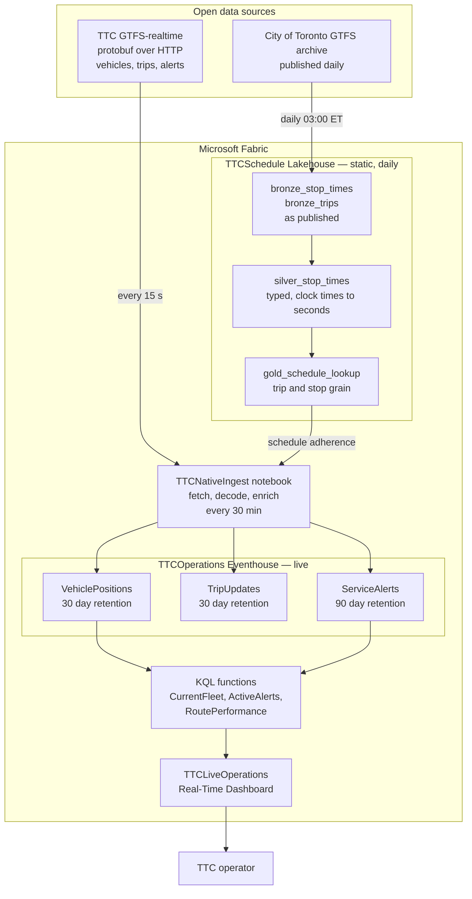

## Scope

This workload is a macro operations and service twin for the Toronto Transit
Commission, running entirely on Microsoft Fabric. It ingests, stores, enriches,
and serves TTC open data without any compute outside Fabric.

It models routes, stops, trips, live surface vehicles, schedule adherence, and
service alerts. It does not model asset health, internal facilities, tunnel
geometry, track condition, signaling, or maintenance telemetry, because those
datasets are not published as TTC open data.

To deploy it, start with the [deployment quickstart](DEPLOYMENT-QUICKSTART.md).
For operations, rollback, and recovery, read [DEPLOYMENT.md](DEPLOYMENT.md).

> [!IMPORTANT]
> TTC BusTime GTFS-realtime covers buses and streetcars. Subway and LRT
> real-time vehicle data is not published. Subway routes and stops appear from
> static GTFS, and the workload never fabricates live subway positions.

Line 5 Eglinton and Line 6 Finch West appear on their own map tile, drawn from
static GTFS. Those stations are infrastructure context, not live positions.
The realtime feed publishes no vehicles for either line, which the tile title
states so nobody reads an empty line as a service outage.

## Data Architecture

Storage is split by how the data behaves. The timetable is republished daily and
earns a Lakehouse with medallion layers. Vehicle telemetry changes every few
seconds and earns an Eventhouse that KQL can serve directly.



### Why the split

| Concern | Static timetable | Live telemetry |
| --- | --- | --- |
| Change rate | Daily | Every few seconds |
| Store | Lakehouse Delta | Eventhouse KQL |
| Shape | Refined bronze to gold | Append only |
| Access | Spark join at ingest | KQL at query time |
| Retention | Overwritten each refresh | 30 and 90 days |

Schedule adherence needs both. The realtime feed reports where a vehicle is, and
the timetable says where it should be, so the ingest notebook joins gold on trip
and stop sequence and wraps the difference into plus or minus twelve hours.

## Fabric Items

| Item | Type | Responsibility |
| --- | --- | --- |
| `TTCSchedule` | Lakehouse | Static GTFS bronze, silver, gold |
| `TTCScheduleBronze` | Notebook | Download archive, chain silver and gold |
| `TTCScheduleSilver` | Notebook | Type rows, parse clock times |
| `TTCScheduleGold` | Notebook | Schedule lookup at serving grain |
| `TTCNativeIngest` | Notebook | Fetch, decode, enrich, load |
| `TTCEventhouse` | Eventhouse | Real-time analytics engine |
| `TTCOperations` | KQL database | Telemetry tables and functions |
| `TTCLiveOperations` | Real-Time Dashboard | Operator surface |
| `TTCTelemetry` | Eventstream | Optional Custom Endpoint path |
| `TTCFeedDecoder` | Notebook | Optional Eventstream decode path |

## Dashboard

`TTCLiveOperations` refreshes every minute and reads Eventhouse directly. No web
tier sits between the operator and the data.

| Tile | Question it answers |
| --- | --- |
| Vehicles in service | How much service is on the street |
| On time percent | How well is the network running |
| Delayed vehicles | How many vehicles are behind |
| Active alerts | What is disrupted right now |
| Feed age minutes | Can I trust what I am seeing |
| Live fleet map | Where is service concentrated |
| Active service alerts | What has been communicated |
| Routes with most delayed vehicles | Where to intervene first |
| Schedule deviation spread | Is lateness broad or concentrated |
| Fleet by mode | Bus and streetcar split |
| Vehicles reporting over time | Is coverage stable |
| Rapid transit stations | Where Line 5 and Line 6 infrastructure sits |

Open it from the Fabric portal. Fabric identity governs access, so there is no
separate sign-in and no publicly reachable endpoint.

## Ingestion

`TTCNativeIngest` runs on a thirty minute schedule and polls for the length of
its window, so one Spark session covers the interval rather than paying startup
on every poll.

Each cycle fetches the three GTFS-realtime feeds, decodes the protobuf, derives
schedule adherence from the gold lookup, and appends to Eventhouse.

`CurrentFleet()` looks back thirty five minutes so the dashboard stays populated
across the gap between scheduled sessions.

## Data Sources

| Source | Licence |
| --- | --- |
| TTC GTFS-realtime | City of Toronto Open Data |
| Merged GTFS routes and schedules | City of Toronto Open Data |

Attribution and dataset links are listed in [DEPLOYMENT.md](DEPLOYMENT.md).

## Repository Layout

```text
fabric/eventhouse/       KQL schema, retention, and serving functions
fabric/dashboard/        Real-Time Dashboard definition
fabric/notebook-ingest/  Fabric-native ingestion
fabric/notebook-bronze/  Static GTFS landing
fabric/notebook-silver/  Typing and cleaning
fabric/notebook-gold/    Schedule lookup
fabric/eventstream/      Optional Custom Endpoint path
scripts/                 Deployment and validation tooling
ingest/                  Publisher used by the optional container path
src/                     React workspace for the optional app path
```

## Commands

| Command | Purpose |
| --- | --- |
| `npm run fabric:plan` | Validate every Fabric definition offline |
| `npm run fabric:deploy` | Provision or update the Fabric workload |
| `npm run typecheck:tools` | Type-check deployment tooling |
| `npm test` | Run the Vitest suite |
| `npm run lint` | Run ESLint |

## Security

The dashboard path runs entirely inside Fabric and is governed by Fabric
identity, with no public endpoint.

The container publisher backs the optional React app. It runs as a query proxy
over Eventhouse and exposes a public unauthenticated HTTPS endpoint. It no
longer publishes to Eventstream, because `TTCNativeIngest` owns ingestion and
running both paths duplicates rows. Read [SECURITY.md](SECURITY.md) before
relying on it.
