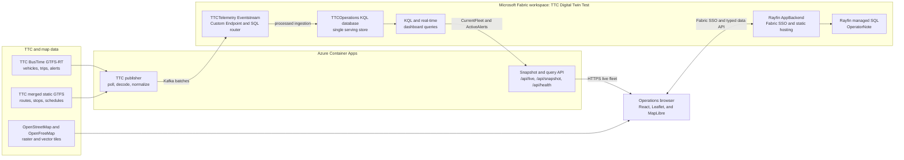

## Scope

This workload is a macro operations and service twin for the Toronto Transit
Commission. It combines Microsoft Fabric Real-Time Intelligence with a Rayfin
Fabric App.

It models routes, stops, trips, live surface vehicles, schedule deviation, and
service alerts. It does not claim to model asset health, internal facilities,
tunnel geometry, track condition, signaling, or maintenance telemetry because
those datasets are not available as TTC open data.

> [!IMPORTANT]
> TTC BusTime GTFS-realtime currently covers buses and streetcars. The open-data
> request for subway and LRT real-time vehicle data remains backlogged. Subway
> routes and stops appear from static GTFS, but the app never fabricates live
> subway positions.

## Architecture

### Runtime Topology



### Component Responsibilities

| Layer | Deployed component | Responsibility |
| --- | --- | --- |
| Ingestion | Container App | Normalize and publish TTC events |
| Live API | HTTPS ingress | Serve KQL results, snapshots, and health |
| Stream routing | `TTCTelemetry` | Route vehicles, trips, and alerts |
| Serving store | `TTCOperations` | Hold telemetry tables and query functions |
| Application | Rayfin AppBackend | Host React, SSO, and the data API |
| Operator data | Managed SQL | Store user-scoped operator notes |
| Map | Leaflet and MapLibre | Render 2D fallback and optional 3D buildings |

> [!NOTE]
> The 2D Leaflet map remains the default and fallback. The optional 3D view
> loads MapLibre in a separate Vite chunk, uses an inline style, and runs its
> module worker from the Rayfin static-hosting origin. Direct OpenFreeMap vector
> tiles provide building height fields without a remote style, sprite, or glyph
> dependency. Browsers without WebGL 2 return to 2D with an operator notice.

### Published Deployment

| Resource | Published value |
| --- | --- |
| Source | [alexaca79/ttc-digitaltwin][source-repository] |
| Fabric app | [TTC Digital Twin][fabric-app] |
| Fabric workspace | `TTC Digital Twin Test` |
| Fabric capacity | `rayfintestenv` (`F64`) |
| Publisher API | [Publisher health endpoint][publisher-health] |
| Publisher scaling | One warm replica, 0.5 CPU, 1 GiB memory |
| Eventstream source | `TTCPublisher` Custom Endpoint |

### Security Boundaries

* The browser receives only public map tiles, the HTTPS snapshot, and a Rayfin
  publishable key. It never receives Fabric Eventstream credentials.
* The production publisher keeps the Eventstream connection string in an Azure
  Container Apps secret and references it through an environment variable.
* The Container App uses its system-assigned managed identity to pull the
  publisher image from Azure Container Registry.
* Snapshot API CORS is restricted to the deployed Rayfin static-hosting origin.
* Fabric SSO protects the deployed application and Rayfin managed SQL access.
* Local `npm run fabric:publisher` retrieves Custom Endpoint credentials at
  startup and keeps them in process memory. Credentials are never written to
  the repository or `.fabric/deployment.local.json`.

[fabric-app]: https://happy-ferry-38f69258e5-westus2.webapp.fabricapps.net/
[publisher-health]: https://ca-ttc-digital-twin-publisher.thankfulplant-49ee7bc3.eastus2.azurecontainerapps.io/api/health
[source-repository]: https://github.com/alexaca79/ttc-digitaltwin

The Eventstream uses processed ingestion, so the workload can be deployed
through the Fabric REST API without a portal-created Eventhouse connection.

See [DEPLOYMENT.md](DEPLOYMENT.md) for the complete fresh-deployment runbook,
validation checks, rollback procedures, monitoring guidance, and operator data
roadmap.

> [!NOTE]
> TTC currently publishes zero in the GTFS-realtime delay fields. The publisher
> estimates schedule deviation by comparing predicted stop timestamps with
> static GTFS stop times in the `America/Toronto` time zone. It uses the median
> deviation across matched stops. Vehicles without a reliable trip and stop
> match remain `Not reported` and are excluded from schedule percentages.

## Local Demo

Prerequisites are Node.js 22 or later and npm.

```powershell
npm install
npm run gtfs:sync
```

Start the live TTC snapshot API in one terminal:

```powershell
npm run ingest
```

Start the dashboard in a second terminal:

```powershell
npm run dev:demo
```

Open <http://localhost:5173>. Demo authentication is automatic. Operator notes
use browser local storage in demo mode. When the publisher is unavailable, the
dashboard switches to clearly labeled deterministic simulation data.

## Fabric Prerequisites

* A Fabric workspace assigned to supported capacity
* Contributor or higher workspace role
* Fabric Apps (preview) enabled by the tenant administrator
* Digital Twin Builder (preview) enabled by the tenant administrator
* Autoscale Billing for Spark disabled for the tenant because Digital Twin
 Builder does not currently support it
* Azure CLI signed in with an isolated `AZURE_CONFIG_DIR`

Set the isolated Azure CLI context before any Fabric operation. The active
tenant and subscription must match the arguments passed to the deployment
script.

```powershell
$env:AZURE_CONFIG_DIR = "$env:USERPROFILE\.azure-tenants\<alias>"
az login --tenant <tenant-id>
az account set --subscription <subscription-id-or-name>
az account show --query "{tenant:tenantId, subscription:name}" --output table
```

## Fabric Deployment

Validate every generated definition without contacting Fabric:

```powershell
npm run fabric:plan
```

Provision or update the RTI items:

```powershell
npm run fabric:deploy -- `
 --tenant-id <tenant-id> `
 --subscription <subscription-id-or-name> `
 --workspace-name <new-workspace-name>
```

You can use `--workspace-id` instead of `--workspace-name`. The script creates
or reuses these items:

* `TTCDigitalTwinLakehouse`
* `TTCEventhouse`
* `TTCOperations` KQL database
* `TTCTelemetry` Eventstream
* `TTCDigitalTwin` Digital Twin Builder
* `TTCDigitalTwinRefresh` Digital Twin Builder flow

The Digital Twin Builder flow groups the Vehicle, Route, and Stop mappings and
their relationships. Run or schedule `TTCDigitalTwinRefresh` from Fabric after
the first Lakehouse events create `bronze.ttc_vehicle_positions`.

Start the live publisher against the deployed Eventstream:

```powershell
npm run fabric:publisher
```

Deploy the authenticated Rayfin app and its `OperatorNote` schema:

```powershell
npx rayfin login
npx rayfin up --workspace-id <workspace-id>
npx rayfin up status
```

Set `VITE_TELEMETRY_API_URL` to a hosted snapshot API before the Rayfin build if
the deployed app should use live telemetry directly. Without it, the app remains
a functional, explicitly labeled simulation while RTI continues ingesting live
events independently.

## Data Sources

* TTC BusTime GTFS-realtime: <https://bustime.ttc.ca/gtfsrt>
* TTC merged routes and schedules:
 <https://open.toronto.ca/dataset/merged-gtfs-ttc-routes-and-schedules/>
* City of Toronto Open Data Licence:
 <https://open.toronto.ca/open-data-licence/>
* Leaflet map renderer: <https://leafletjs.com/>
* MapLibre GL JS renderer: <https://maplibre.org/maplibre-gl-js/docs/>
* OpenFreeMap vector tiles: <https://openfreemap.org/>
* OpenStreetMap standard tiles and map data:
  <https://www.openstreetmap.org/copyright>

The generated static asset records its source URL, generation time, and licence
URL. The current verified sync produced 224 routes, 11,946 stops, 133,557 trips,
and eight service calendars. The sync also creates a byte-offset schedule index,
which lets the publisher read and cache only active trips from the full
`stop_times.txt` file.

## Repository Layout

```text
fabric/                 Fabric item definitions, KQL, and dashboard queries
ingest/                 GTFS-realtime decoder, API, and Eventstream publisher
rayfin/                 Rayfin configuration and typed operator-note schema
scripts/                Static GTFS sync and Fabric deployment tooling
src/                    React operations workspace
public/data/            Generated compact TTC network asset
```

## Commands

| Command | Purpose |
| --------- | --------- |
| `npm run dev:demo` | Run the local dashboard without Rayfin Docker services |
| `npm run ingest` | Poll TTC and expose the local snapshot API continuously |
| `npm run ingest:once` | Decode and normalize one live TTC poll |
| `npm run gtfs:sync` | Refresh static TTC data and rebuild the schedule index |
| `npm run fabric:plan` | Validate all parameterized Fabric definitions |
| `npm run fabric:deploy` | Provision or update the Fabric RTI workload |
| `npm run fabric:publisher` | Publish to the Custom Endpoint |
| `npm run rayfin:up` | Deploy the Rayfin Fabric App |
| `npm run build` | Create a production frontend build |
| `npm run typecheck:tools` | Type-check publisher and deployment scripts |
| `npm test` | Run the Vitest suite |
| `npm run lint` | Run ESLint |
