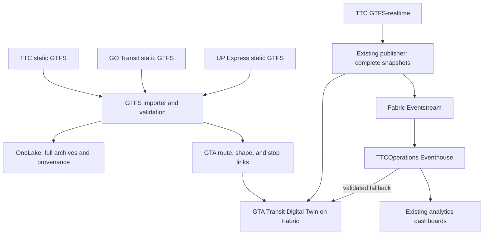

## Scope

GTA Transit Digital Twin combines TTC, GO Transit, and UP Express routes,
geometry, stops, trips, and service calendars. The Fabric-hosted application
supports agency and transport-mode filters, scheduled route and station search,
route focusing, and feed provenance. TTC bus and streetcar live telemetry comes
from the existing publisher and Eventhouse pipeline.

The application models published service, not asset health, internal facilities,
tunnel geometry, track condition, signaling, or maintenance telemetry. A static
GTFS trip is a scheduled trip, not an observed vehicle or proof that it ran.

To deploy it, start with the [deployment quickstart](DEPLOYMENT-QUICKSTART.md).
For operations, rollback, and recovery, read [DEPLOYMENT.md](DEPLOYMENT.md).

> [!IMPORTANT]
> TTC BusTime GTFS-realtime covers buses and streetcars. Subway and LRT
> real-time vehicle data is not published. Subway routes and stops appear from
> static GTFS, and the workload never fabricates live subway positions. The
> application's live KPIs remain explicitly TTC-only when GO or UP is selected.

GO Transit includes all seven rail corridors and the bus routes present in its
official feed. UP Express has its own feed and agency filter. GO/UP live vehicle
positions and live delay KPIs are not enabled: their authenticated real-time
feed access is not configured. The UI labels these routes as scheduled service.

The September 28 import contains 281 routes, 10,411 linked stops/stations, and
267,287 trips across the feeds' published service windows. These are not daily
or concurrently operating trip counts. Every supplied GTFS table is retained,
including GO fare, transfer, and stop-amenity files. Retention does not imply
that fare calculation or every optional GTFS extension has a dedicated UI.

## Data Architecture

Static data and live observations remain separate. Official TTC, GO, and UP
archives are retained in OneLake, and the map-ready network is published with
the app. The existing TTC schedule medallion notebooks remain available. Live
TTC observations flow through the publisher and Eventstream into Eventhouse.


```mermaid
flowchart TB
  TTC["TTC static GTFS"] --> Import["GTFS importer and validation"]
  GO["GO Transit static GTFS"] --> Import
  UP["UP Express static GTFS"] --> Import
  Import --> Archives["OneLake: full archives and provenance"]
  Import --> Network["GTA route, shape, and stop links"]
  Network --> App["GTA Transit Digital Twin on Fabric"]
  RT["TTC GTFS-realtime"] --> Publisher["Existing publisher: complete snapshots"]
  Publisher --> App
  Publisher --> Eventstream["Fabric Eventstream"]
  Eventstream --> Eventhouse["TTCOperations Eventhouse"]
  Eventhouse --> Dash["Existing analytics dashboards"]
  Eventhouse -->|"validated fallback"| App
```

### Why the split

| Concern | Static timetable | Live telemetry |
| --- | --- | --- |
| Change rate | Daily | Every few seconds |
| Store | Lakehouse Delta | Eventhouse KQL |
| Shape | Refined bronze to gold | Append only |
| Access | Spark join at ingest | KQL at query time |
| Retention | Overwritten each refresh | 30 and 90 days |

Schedule adherence needs both. The realtime feed reports where a vehicle is, and
the timetable says where it should be, so the ingest notebook joins gold on trip
and stop sequence and wraps the difference into plus or minus twelve hours.

## Fabric Items

| Item | Type | Responsibility |
| --- | --- | --- |
| `TTCSchedule` | Lakehouse | Static GTFS bronze, silver, gold |
| `TTCScheduleBronze` | Notebook | Download archive, chain silver and gold |
| `TTCScheduleSilver` | Notebook | Type rows, parse clock times |
| `TTCScheduleGold` | Notebook | Schedule lookup at serving grain |
| `TTCNativeIngest` | Notebook | Fetch, decode, enrich, load |
| `TTCEventhouse` | Eventhouse | Real-time analytics engine |
| `TTCOperations` | KQL database | Telemetry tables and functions |
| `TTCLiveOperations` | Real-Time Dashboard | Operator surface |
| `TTCTelemetry` | Eventstream | Optional Custom Endpoint path |
| `TTCFeedDecoder` | Notebook | Optional Eventstream decode path |
| `GoTtcInterchange` | Notebook | GO and TTC interchange connection analysis |

## Dashboards

`TTCLiveOperations` refreshes every minute and reads Eventhouse directly. No web
tier sits between the operator and the data.

| Tile | Question it answers |
| --- | --- |
| Vehicles in service | How much service is on the street |
| On time percent | How well is the network running |
| Delayed vehicles | How many vehicles are behind |
| Active alerts | What is disrupted right now |
| Feed age minutes | Can I trust what I am seeing |
| Live fleet map | Where is service concentrated |
| Active service alerts | What has been communicated |
| Routes with most delayed vehicles | Where to intervene first |
| Schedule deviation spread | Is lateness broad or concentrated |
| Fleet by mode | Bus and streetcar split |
| Vehicles reporting over time | Is coverage stable |
| Rapid transit stations | Where Line 5 and Line 6 infrastructure sits |

Open it from the Fabric portal. Fabric identity governs access, so there is no
separate sign-in and no publicly reachable endpoint.

### Executive view

`TTCExecutiveView` answers the questions a service owner asks rather than a
controller. It reports on time performance against a benchmark, the trend over
days, which corridors need intervention now, and which ones breach the
benchmark repeatedly rather than occasionally.

| Tile | Question it answers |
| --- | --- |
| On time performance | Is the network meeting the standard |
| Variance to benchmark | By how much are we missing it |
| Vehicles and routes | How much service is actually running |
| Active disruptions | What is degrading the network |
| 90th percentile delay | How bad is the tail, not the average |
| Daily trend | Are we improving or drifting |
| Service period | Is the problem concentrated in a peak |
| Corridors needing intervention | Where to act today |
| Chronic underperformers | What is structural, not incidental |

On time means within five minutes of schedule, the common transit standard.
The 90 percent benchmark is a parameter, not an official TTC commitment.
Metrolinx publishes roughly 95 percent for GO rail.

This view covers service performance only. Ridership, revenue, vehicle
reliability, customer satisfaction, and safety are not in any open feed this
workload consumes, so the view does not imply them.

### Application metrics

The web application's top metrics use the publisher's complete `/api/snapshot`
response first. Eventhouse ingests records asynchronously, so counting a batch
that is still arriving can understate the current fleet. `/api/live` remains a
fallback and includes only observations from the last two minutes. An empty
Eventhouse fleet is unavailable, not a newly observed zero-vehicle fleet.

These metrics are network-wide and do not change with map filters. On schedule
means between two minutes early and three minutes late, inclusive, among
vehicles with a finite schedule estimate. Unknown estimates are excluded from
the percentage; coverage and the measured denominator are displayed. This is
separate from the executive dashboard's five-minute benchmark.

Loading and unavailable metrics are not displayed as zero. Failed refreshes
retain the last successful snapshot; stale, paused, and simulated data are
explicitly labeled. Keep the bundled timetable current with `npm run gtfs:sync`
and rebuild the publisher when TTC changes its schedule.

The publisher image bundles the TTC timetable at build time, and a republished
TTC feed can reuse trip IDs for unrelated trips. The publisher therefore
ignores a schedule match when the timetable places the trip on a different
route than the realtime update, or when the gap exceeds two hours. Those
vehicles show as not reported rather than hours early or late, so a drop in
estimate coverage is the signal to rebuild the publisher.

### Spatial data

`npm run gtfs:sync` imports TTC, GO Transit, and UP Express route shapes through the GTFS
`routes -> trips -> shapes` relationships. Each route's `paths` array retains
separate branches and directions; renderers never connect one shape's endpoint
to another shape's start. Turf simplifies each shape with a `0.00001` degree
tolerance (about one metre), preserving endpoints and meaningful turns.

Both map renderers paint buses first, then streetcars, regional rail, and the
TTC subway lines, so rapid transit stays visible above the dense surface
network. Subway and rail lines draw wider than surface routes, and a focused
route paints above everything else.

Stops are linked through `trips -> stop_times -> stops`. Platforms and their
parent stations follow the selected bus, streetcar, or subway routes; entrances
and unserved stops are excluded. Transport modes follow GTFS `route_type`, with
one exception: type 0 covers both streetcars and light rail, so TTC's light rail
rapid transit lines, which TTC names `<name> Line` (Line 5 Eglinton and Line 6
Finch West), are grouped with the subway lines. Regional rail uses type 2. GO
and UP identifiers are prefixed with `go:` and `up:`; original GTFS IDs are
retained. TTC IDs stay unchanged for live joins.
The app displays a spatial-data error when official geometry is unavailable
instead of silently substituting hand-drawn demo lines.

Run spatial browser checks with `UI_TEST_SPATIAL_ONLY=true` and
`npm run validate:ui` against the local demo server. These checks use the real
imported geometry and fixture telemetry across both map renderers and desktop
and mobile viewports. Publish the rebuilt static app after regenerating
`public/data/gta-network.json`; no telemetry-table rewrite is required. The
TTC-only asset remains available for compatibility.

Raw feeds and indexes are stored under `data/gtfs-static/` for TTC and its
`go/` and `up/` subdirectories. Each feed has an import manifest containing its
source, licence, date range, version, file list, and counts. `TTC_GTFS_STATIC_URL`,
`GO_GTFS_STATIC_URL`, and `UP_GTFS_STATIC_URL` can override the official URLs.
Each deployed source snapshot is retained under
`TTCSchedule/Files/gta-gtfs/<UTC timestamp>/` in OneLake, and earlier snapshots
are kept. The current one is `20260930T1732Z`. The archives include all
tables supplied by each agency, not only the subset used by the map renderer.

## GO and TTC Interchange Analysis

The `GoTtcInterchange` notebook asks how well GO trains and TTC routes hand
riders to each other. It reads the newest GTFS snapshot in OneLake, picks the
first weekday from today that both agencies run, and studies every GO rail
station with TTC stops within a 350 m walk.

| Question | Measure |
| --- | --- |
| Are TTC departures timed around GO arrivals? | Coordination index per TTC route-direction, tested against randomly shifted GO arrivals |
| How long from a train to the first TTC vehicle? | Minutes from each GO arrival to the first reachable TTC departure, including the walk |
| Do TTC feeders aim at GO departures? | TTC arrivals landing just before versus just after each GO departure |
| How often does TTC lateness cost a rider the train? | Live TTC schedule deviation from `TTCOperations` applied to the tightest planned connections |

On the October 1, 2026 timetable, 23 of 71 GO rail stations are TTC
interchanges. The median coordination index across TTC route-directions is
0.99, and TTC feeder arrivals split evenly before and after GO departures, so
the two timetables are planned independently. Handoffs take a median of about
3 to 5 minutes at Eglinton, Kipling, and Mount Dennis but 11 to 27 minutes at
Old Cummer, Markham, and Mount Joy. Observed TTC lateness would break about
13 percent of the tightest planned TTC to GO connections.

Results are overwritten in `gold_go_ttc_interchanges`, `gold_go_ttc_handoffs`,
and `gold_go_ttc_feeder_risk` in the `TTCSchedule` lakehouse. Each row carries
its service date and GTFS snapshot. Connections are planned, not observed:
GO real-time data is not configured, so GO punctuality is not modelled.

## Ingestion

The application deployment uses the continuously running publisher and the
Eventstream's vehicle, trip, and alert destinations. Keep the alternate
`TTCNativeIngest` schedule disabled when this path is active to avoid duplicate
ingestion.

Set `TTC_POLL_INTERVAL_MS=60000` for the deployed publisher. Publishing complete
trip-update feeds every 15 seconds can build up an Eventstream backlog; the
one-minute cadence matches the operations dashboard refresh. The web client
checks for a new complete snapshot every 15 seconds and displays its age.

For the Fabric-native alternative, `TTCNativeIngest` runs on a thirty minute
schedule and polls for the length of its window, so one Spark session covers
the interval rather than paying startup on every poll.

Each cycle fetches the three GTFS-realtime feeds, decodes the protobuf, derives
schedule adherence from the gold lookup, and appends to Eventhouse.

`CurrentFleet()` looks back thirty five minutes so the dashboard stays populated
across the gap between scheduled sessions.

## Data Sources

| Source | Licence |
| --- | --- |
| TTC GTFS-realtime | City of Toronto Open Data |
| Merged GTFS routes and schedules | City of Toronto Open Data |
| GO Transit static GTFS | Metrolinx Open Data |
| UP Express static GTFS | Metrolinx Access and Use Agreement |

Attribution and dataset links are listed in [DEPLOYMENT.md](DEPLOYMENT.md).

## Repository Layout

```text
fabric/eventhouse/       KQL schema, retention, and serving functions
fabric/dashboard/        Real-Time Dashboard definition
fabric/notebook-ingest/  Fabric-native ingestion
fabric/notebook-bronze/  Static GTFS landing
fabric/notebook-silver/  Typing and cleaning
fabric/notebook-gold/    Schedule lookup
fabric/notebook-interchange/  GO and TTC interchange analysis
fabric/eventstream/      Optional Custom Endpoint path
scripts/                 Deployment and validation tooling
ingest/                  Publisher used by the optional container path
src/                     React workspace for the optional app path
```

## Commands

| Command | Purpose |
| --- | --- |
| `npm run fabric:plan` | Validate every Fabric definition offline |
| `npm run fabric:deploy` | Provision or update the Fabric workload |
| `npm run typecheck:tools` | Type-check deployment tooling |
| `npm test` | Run the Vitest suite |
| `npm run lint` | Run ESLint |

## Security

The dashboard path runs entirely inside Fabric and is governed by Fabric
identity, with no public endpoint.

The container publisher backs the optional React app. It runs as a query proxy
over Eventhouse and exposes a public unauthenticated HTTPS endpoint. It no
longer publishes to Eventstream, because `TTCNativeIngest` owns ingestion and
running both paths duplicates rows. Read [SECURITY.md](SECURITY.md) before
relying on it.
